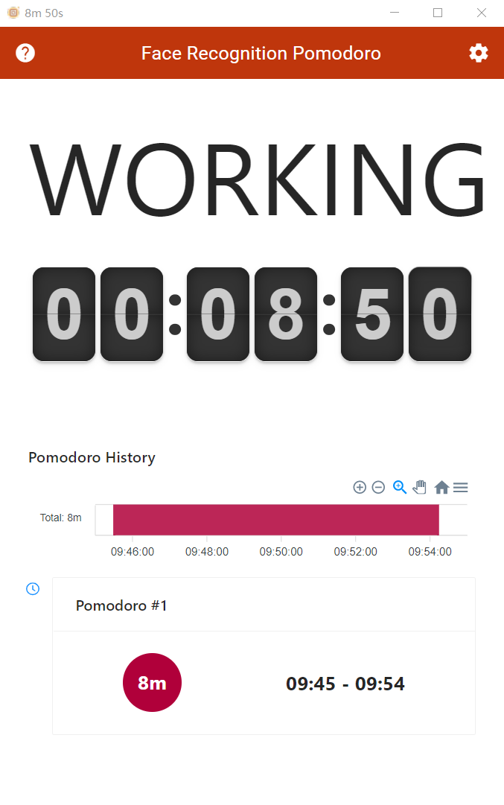
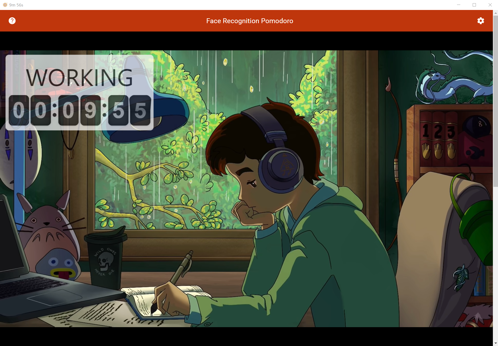

# Face Recognition Pomodoro

Live demo: https://chenditc.github.io/face-recognition-pomodoro

Electron wrapped desktop version: https://github.com/chenditc/face-recognition-pomodoro/releases/download/0.0.1/Face.Recognition.Pomodoro-win32-x64-always-on-top.zip

## What is this?

This is a **Pomodoro Clock**. It's special because:

- It can automatically help you start **a focus session** when the camera detected your face.
- It can automatically start **a rest session** When the camera no longer detect your face 

We will need two permission from you:
- Permission to **send notification**, so that you will get reminded when session timed out.
- Permission to **access your camera**.

Please click allow button around the browser's url.

## Features

- Status message showing "WORKING" / "REST"
- Flip clock showing current session duration.
- Pomodoro History
  - Today's focus time distribution and total time.
  - All past pomodoro session's information.

- Youtube immersive view. 
  - Play youtube video in the background, music will be played when you are working and not work overtime.
  - Draggable status and flip clock panel.

### What if I left my camera but don't want to stop the Pomodoro session?

If the time of stepping away is less than **Max Allowed Missing Time**
in the settings, the Pomodoro session will continue the session when you are back.

### Will this slow down my computer or phone?

Usually not, it leverage GPU to detect your face and just takes a few milliseconds.

## Available Scripts

In the project directory, you can run:

### `npm install`

Install the necessary components dependency.

### `npm start`

Runs the app in the development mode.\
Open [http://localhost:3000](http://localhost:3000) to view it in your browser.

The page will reload when you make changes.\
You may also see any lint errors in the console.

### `npm test`

Launches the test runner in the interactive watch mode.\
See the section about [running tests](https://facebook.github.io/create-react-app/docs/running-tests) for more information.
